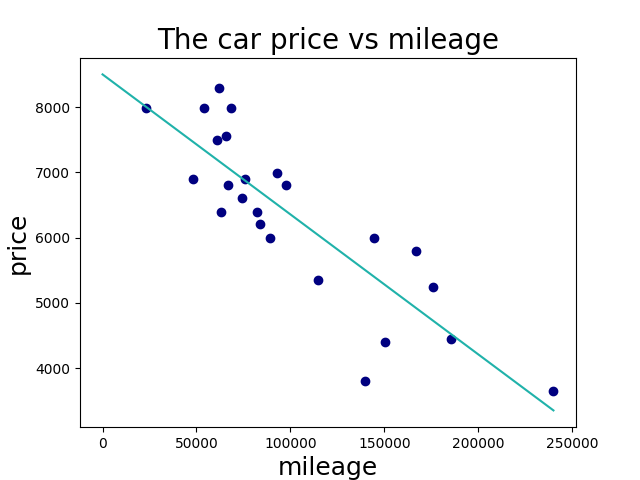

# linear_regression

An Algo Project at Codam Advanced (42) - Linear Regression </br>
An introduction to machine learning

## Project Discription
The aim of this project is an introduction to the basic concept behind machine learning. </br>
This project having a program that predicts the price of a car by using a linear function trained with a gradient descent algorithm.</br>
There is an implementation of a simple linear regression with a single feature - in this case, the mileage of the car.
</br>
The trainer will make a Linear Regression from the data that is comming in and set the data in a graph.</br>
`train.py` functions with `csv` files with `,` as separator<br>


## Usage

```
python3 train.py
python3 predict.py
python3 precision.py
```

Befor you use the predictor or precision, the trainer needs to be run. 
<br>
Otherwise there is no trainingdata to predict and to check the position.
